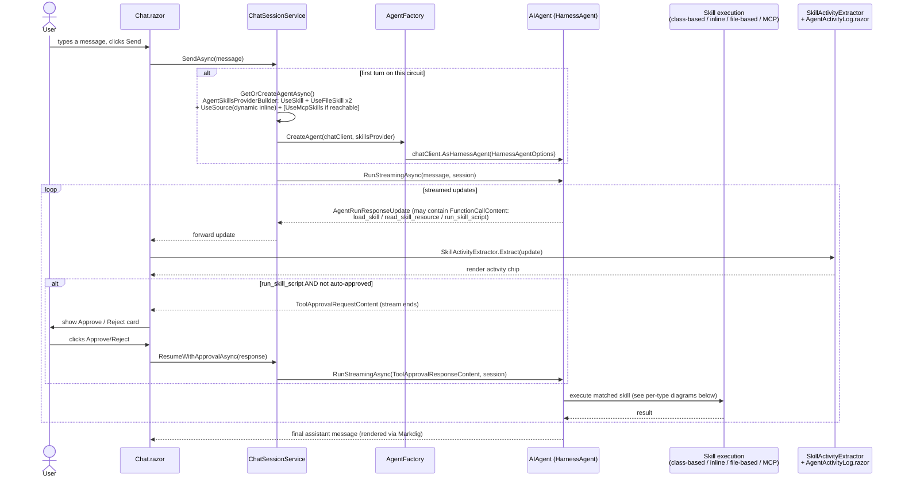
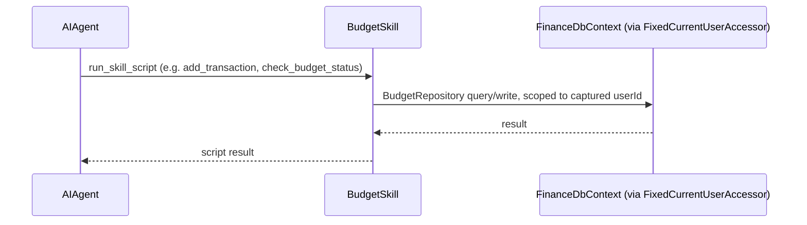
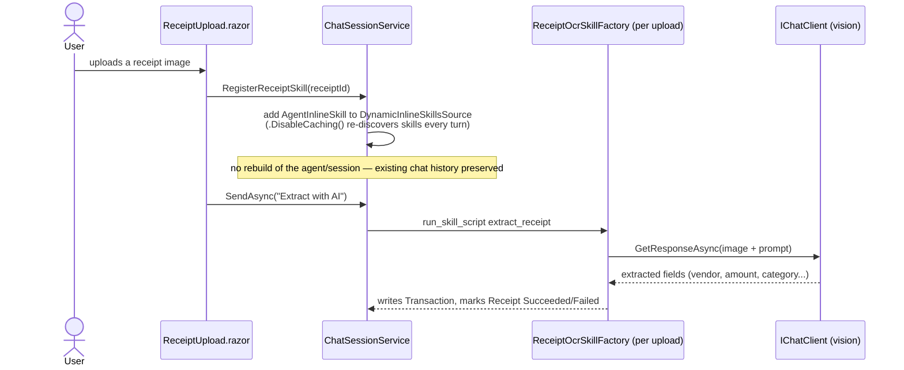
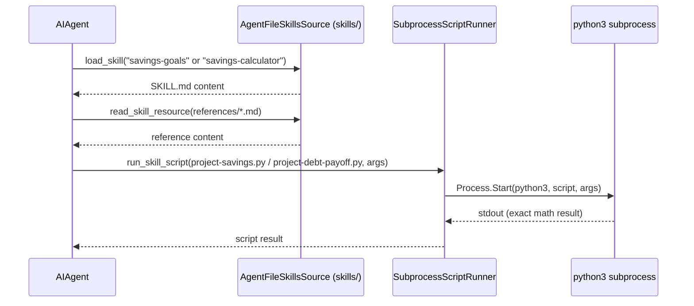
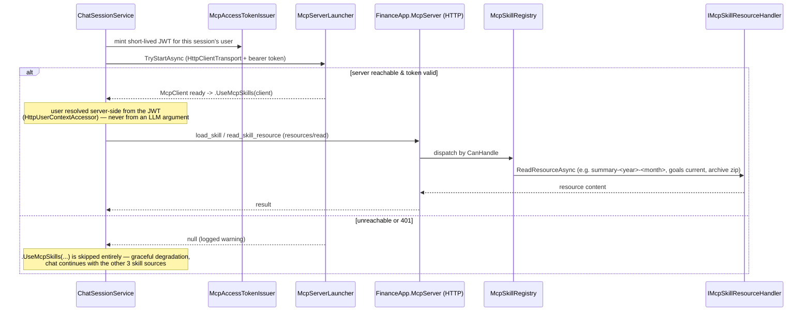

# MyFinanceWithAgentSkill

A personal-finance web app (transactions, budgets, receipts, savings goals, monthly summaries) whose
**real purpose is to demonstrate [Microsoft Agent Framework's Skills feature](https://learn.microsoft.com/en-us/agent-framework/agents/skills?pivots=programming-language-csharp)
end-to-end** — one finance feature per skill-source type, wired into a real Blazor chat UI with streaming,
tool-call approval, and an activity log you can watch.

📖 The full technical specification — data model, every design decision, verification checklist — lives in
[`docs/spec.md`](docs/spec.md). This README is an orientation; `spec.md` is the source of truth.

## Why four different skill types?

Each finance feature deliberately uses a *different* Agent Framework skill source, on purpose:

| Feature | Skill type | Where it lives |
|---|---|---|
| Transactions & budgeting | Class-based (`AgentClassSkill<T>`) | `src/FinanceApp.Skills/Budgeting/BudgetSkill.cs` |
| Receipt OCR | Code-defined / inline (`AgentInlineSkill`, built per upload) | `src/FinanceApp.Skills/ReceiptOcr/ReceiptOcrSkillFactory.cs` |
| Savings / investment goals | File-based (`SKILL.md` + `references/` + scripts) | `skills/savings-goals/`, `skills/savings-calculator/` |
| Monthly summary, goals progress, emergency fund, debt payoff | MCP-based (standing HTTP MCP server, JWT bearer) | `src/FinanceApp.McpServer/` |

## Tech stack

- **Runtime**: .NET 10, new `.slnx` solution format
- **UI**: Blazor Server (Interactive Server render mode) + [MudBlazor](https://mudblazor.com/) 9.8.0;
  [Markdig](https://github.com/xoofx/markdig) 1.3.2 (`.UseAdvancedExtensions().DisableHtml()`) renders
  assistant messages as sanitized markdown/tables
- **Data**: PostgreSQL via `Npgsql.EntityFrameworkCore.PostgreSQL` 10.0.3, ASP.NET Core Identity
  (`Microsoft.AspNetCore.Identity.EntityFrameworkCore` 10.0.12, `IdentityDbContext<ApplicationUser>`)
- **Agents / skills**: `Microsoft.Agents.AI` + `Microsoft.Agents.AI.Harness` 1.22.0 (`HarnessAgent`,
  `AgentSkillsProviderBuilder`), `Microsoft.Extensions.AI` 10.10.0 (`IChatClient` abstraction)
- **LLM providers** (switched by config, one `IChatClient` construction path for all 5):
  - Azure OpenAI / OpenAI — `Microsoft.Extensions.AI.OpenAI` + `OpenAI` 2.14.0
  - Ollama — `OllamaSharp` 5.4.30
  - Gemini — `Google_GenerativeAI.Microsoft` 3.6.7
  - Anthropic — `Anthropic.SDK` 5.10.0 (used directly; the Microsoft Agent-level Anthropic package is
    agent-only, not chat-client-level)
- **MCP**: `ModelContextProtocol` / `ModelContextProtocol.AspNetCore` + `Microsoft.Agents.AI.Mcp`
  1.22.0-alpha, `System.IdentityModel.Tokens.Jwt` 8.23.0 for bearer tokens
- **Testing**: xUnit, `Microsoft.EntityFrameworkCore.InMemory`, `Microsoft.AspNetCore.Mvc.Testing`
  (`WebApplicationFactory<Program>`) — **no Testcontainers, no Docker/Postgres/LLM required** to run the
  suite (see [Testing](#testing) below)

Multi-provider `ChatClientFactory` is ported from a sister project's pattern
(`github.com/pingkunga/gitea-aihook`).

## Project structure

```
src/
  FinanceApp.Core/        Domain entities (incl. ApplicationUser : IdentityUser<Guid>), IdentityDbContext,
                           repositories (BudgetRepository, MonthlySummaryRepository, SavingsGoalRepository).
                           Referenced by Web and McpServer; references nothing else.
  FinanceApp.AI/           ChatClientFactory (multi-provider -> IChatClient), AgentFactory
                           (IChatClient -> AIAgent), SkillActivity.cs (SkillActivityExtractor,
                           SkillActionClassifier, SkillApprovalPolicy). No ASP.NET dependency.
  FinanceApp.Skills/       BudgetSkill (class-based), ReceiptOcrSkillFactory (inline),
                           SubprocessScriptRunner (backs the file-based skill's Python scripts).
                           No ASP.NET dependency -> plain-async unit-testable.
  FinanceApp.McpServer/    Standing ASP.NET Core HTTP service, JWT-bearer auth. McpSkillRegistry +
                           IMcpSkillResourceHandler per skill; hosts skills/monthly-summary,
                           skills/goals-progress, skills/emergency-fund, skills/debt-payoff-strategies.
                           Read-only against the shared Postgres DB — never migrates.
  FinanceApp.Web/          Blazor Server host. Owns all EF migrations. ChatSessionService, Chat.razor,
                           AgentActivityLog.razor, ReceiptUpload.razor, Goals.razor, Transactions.razor,
                           Budgets.razor.

tests/
  FinanceApp.Skills.Tests/    BudgetSkill + repository tests (EF Core InMemory, no LLM, no Docker)
  FinanceApp.AI.Tests/        File-based skill round-trip tests (scripted IChatClient against real
                               skills/ content)
  FinanceApp.McpServer.Tests/ MCP handler + real subprocess-over-HTTP + WebApplicationFactory tests

skills/                          File-based skill content (bundled into FinanceApp.Web)
  savings-goals/SKILL.md + references/{compound-interest,fifty-thirty-twenty}.md
  savings-calculator/SKILL.md + references/formula.md + scripts/{project-savings,project-debt-payoff}.py

src/FinanceApp.McpServer/skills/   MCP-hosted skill content
  monthly-summary/SKILL.md         (skill-md type, live-computed summary-<year>-<month> resource)
  goals-progress/SKILL.md          (skill-md type, live SavingsGoalRepository data)
  emergency-fund/SKILL.md + references/{how-much,where-to-keep-it}.md          (archive type)
  debt-payoff-strategies/SKILL.md + references/{avalanche,snowball}.md         (archive type)

docs/
  spec.md                                    Full technical specification (source of truth)
  diagram_chatsession_approval_flow.md       Detailed mermaid doc for the tool-approval sub-flow
```

## Getting started

**Prerequisites**: .NET 10 SDK, Docker (for Postgres and/or the full stack), optionally a local `python3`
if you want `savings-calculator`'s scripts to actually execute (the Docker image for `FinanceApp.Web`
installs it; it is *not* guaranteed present on every dev machine — see [Testing](#testing)).

1. Copy `.env.example` to `.env` and fill in values:

   | Variable | Purpose |
   |---|---|
   | `POSTGRES_DB` / `POSTGRES_USER` / `POSTGRES_PASSWORD` | Postgres container credentials |
   | `AI__ENGINE_TYPE` | `Azure` \| `OpenAI` \| `Ollama` \| `Gemini` \| `Anthropic` |
   | `AI__ENDPOINT` / `AI__MODEL_NAME` / `AI__API_KEY` | Provider connection details |
   | `AI__SUPPORTS_VISION` | Enables the receipt-OCR skill's multimodal path |
   | `MCP_BASE_URL` | Where `FinanceApp.Web` reaches the standing MCP server |
   | `MCP_SIGNING_KEY` | Shared signing key for the short-lived per-session JWT the Web app mints |
   | `AUTO_MIGRATE` | Gate for `FinanceApp.Web` running `Database.MigrateAsync()` on startup |

2. **Local dev inner loop** (McpServer is a standing service — start it first, it's no longer spawned as
   a per-session subprocess):

   ```bash
   docker compose up postgres -d
   dotnet run --project src/FinanceApp.McpServer   # standing HTTP service
   dotnet run --project src/FinanceApp.Web         # auto-migrates DB, connects to McpServer over HTTP
   dotnet watch --project src/FinanceApp.Web       # hot reload variant
   ```

3. **Full stack via Docker Compose** (`postgres` + `mcpserver` + `web`; `ollama` is commented out by
   default, assuming a host-installed Ollama reachable via `host.docker.internal`):

   ```bash
   docker compose up --build
   ```

4. **Tests** (whole suite, no Docker/Postgres/LLM needed — see [Testing](#testing)):

   ```bash
   dotnet test
   ```

5. **EF Core migrations** (`FinanceApp.Web` is the design-time startup project, not `Core`):

   ```bash
   dotnet ef migrations add <Name> --project src/FinanceApp.Core --startup-project src/FinanceApp.Web
   ```

## How a chat turn flows: UI → ChatSessionService → skill execution

Every chat turn goes through the same pipeline regardless of which skill eventually fires. This is the
combined view; see [`docs/diagram_chatsession_approval_flow.md`](docs/diagram_chatsession_approval_flow.md)
for a more detailed treatment of just the tool-approval sub-flow.



Two-tier approval: `load_skill` and `read_skill_resource` are **never** gated
(`DisableLoadSkillApproval`/`DisableReadSkillResourceApproval` = `true`); only `run_skill_script` reaches
`SkillActionClassifier.Classify` → `SkillApprovalPolicy.IsAutoApproved`, keyed on the user's
`AutoApproveWrites` / `AutoApproveExecuteScript` flags on `ApplicationUser`.

### Per-skill-type branches

**Class-based — Budgeting** (in-process, no approval-affecting I/O beyond the DB):



**Inline — Receipt OCR** (skill is registered *mid-session*, before or during a chat, not at agent build
time):



**File-based — Savings goals + calculator** (two cooperating skills: guidance-only `savings-goals`,
script-backed `savings-calculator`):



**MCP-based — Monthly summary, goals progress, emergency fund, debt payoff** (standing HTTP service,
never trusts an LLM-supplied user id):



### Key files to jump to

| Step | File | Key members |
|---|---|---|
| UI entry | `src/FinanceApp.Web/Components/Pages/Chat.razor` | `SendAsync`, `DrainAsync`, `RespondToApprovalAsync` |
| Session/agent orchestration | `src/FinanceApp.Web/Services/ChatSessionService.cs` | `SendAsync`/`SendAsyncCore`, `ResumeWithApprovalAsync`, `GetOrCreateAgentAsync`, `RegisterReceiptSkill` |
| Agent construction | `src/FinanceApp.AI/AgentFactory.cs` | `AgentFactory.CreateAgent` |
| Approval policy + activity extraction | `src/FinanceApp.AI/SkillActivity.cs` | `SkillActionClassifier`, `SkillApprovalPolicy`, `SkillActivityExtractor` |
| Activity log UI | `src/FinanceApp.Web/Components/Pages/AgentActivityLog.razor` | renders `List<SkillActivityEntry>` |
| Class-based skill | `src/FinanceApp.Skills/Budgeting/BudgetSkill.cs` | `add_transaction`, `check_budget_status`, `transfer_budget`, `contribute_to_goal`, ... |
| Inline skill | `src/FinanceApp.Skills/ReceiptOcr/ReceiptOcrSkillFactory.cs` | `Create`, script `extract_receipt`, resource `receipt_status` |
| File-based skill runner | `src/FinanceApp.Skills/SubprocessScriptRunner.cs` | `RunAsync` |
| MCP token issuance / client | `src/FinanceApp.Web/Services/McpAccessTokenIssuer.cs`, `McpServerLauncher.cs` | `TryStartAsync` |
| MCP server registry | `src/FinanceApp.McpServer/McpSkillRegistry.cs` | aggregates every `IMcpSkillResourceHandler` |

## Testing

`dotnet test` at the repo root runs everything — the whole suite is **Docker/Postgres/LLM-free**.

**Class-based (`BudgetSkill`)** — `tests/FinanceApp.Skills.Tests`
- `BudgetSkillTests` calls `[AgentSkillScript]` methods directly as plain async calls (no LLM), including
  explicit cross-user isolation tests.
- `BudgetAllocationSummaryTests`, `BudgetStatusTests`, `MonthlySummaryRepositoryTests`,
  `SavingsGoalRepositoryTests` cover the underlying repositories.
- Infra: EF Core InMemory, `FixedCurrentUserAccessor`. No Docker.

**Inline (`ReceiptOcrSkillFactory`)** — `tests/FinanceApp.Skills.Tests/ReceiptOcrSkillFactoryTests.cs`
- Scripted `FakeChatClient`/`ThrowingChatClient` doubles cover category matching, vendor-history override,
  missing-amount and chat-client-failure paths, and the `receipt_status` resource.
- **Gap**: the actual multimodal OCR call against a real vision-capable provider is not exercised here —
  manual verification needed once a real provider is configured.

**File-based (`savings-goals` + `savings-calculator`)** — `tests/FinanceApp.AI.Tests/FileSkillTests.cs` +
`tests/FinanceApp.Skills.Tests/SubprocessScriptRunnerTests.cs`
- `FileSkillTests` runs a real round trip against the actual `skills/` directory content
  (`load_skill`/`read_skill_resource`) using a scripted `IChatClient`, but stops short of
  `run_skill_script`.
- `SubprocessScriptRunnerTests` covers argument-handling/error paths and confirms real script discovery,
  but every case short-circuits before `Process.Start`.
- **Gap**: `python3` is not available in this dev environment, so `project-savings.py`/
  `project-debt-payoff.py` are never actually executed end-to-end here.

**MCP-based (`monthly-summary`, `goals-progress`, `emergency-fund`, `debt-payoff-strategies`)** —
`tests/FinanceApp.McpServer.Tests`
- Handler-level tests (`MonthlySummaryResourceHandlersTests`, `GoalsProgressResourceHandlersTests`,
  `ArchiveSkillResourceHandlerTests`, `McpSkillRegistryTests`) run against EF Core InMemory.
- `McpServerConcurrentIsolationTests` uses a real `WebApplicationFactory<Program>` to prove per-request
  JWT-scoped user isolation — the property handler-level tests alone can't structurally prove.
- `McpServerProcessTests` spawns the real server as a subprocess and talks to it over real HTTP with a real
  `McpClient`, including three explicit 401 cases (missing / invalid / expired token).
- **Gap**: no live Postgres here, so reading a real `summary-<year>-<month>` resource end-to-end is
  untested; whether `Microsoft.Agents.AI.Mcp`'s own client-side archive-download path handles the
  base64 wire quirk the same way as the raw `ModelContextProtocol.Client.McpClient` is also unverified (no
  live LLM/agent in this environment).

## Example prompts

Type these into the chat UI — the same request works in Thai or English; both are shown for reference.

| Feature | Thai | English |
|---|---|---|
| Budgeting | เดือนนี้ฉันใช้เงินไปเท่าไหร่แล้วในหมวดอาหาร | How much have I spent on Food this month? |
| Budgeting | ช่วยโอนงบจากหมวดบันเทิงไปหมวดของใช้ในบ้าน 500 บาท | Transfer 500 THB of budget from Entertainment to Household |
| Receipt OCR | ช่วยอ่านใบเสร็จนี้ให้หน่อย แล้วบันทึกเป็นรายการให้ด้วย | Please read this receipt and record it as a transaction |
| Savings goals | ถ้าฉันเก็บเดือนละ 5,000 บาท จะถึงเป้าหมาย 100,000 บาทเมื่อไหร่ | If I save 5,000 THB a month, when will I reach my 100,000 THB goal? |
| Savings goals | แนะนำวิธีจัดสรรเงินเดือนแบบ 50/30/20 ให้หน่อย | Explain the 50/30/20 budgeting rule for allocating my income |
| Monthly summary | สรุปการเงินเดือนนี้ให้หน่อย พร้อมคำแนะนำ | Summarize this month's finances with advice |
| Goals progress | เป้าหมายการออมของฉันตอนนี้ไปถึงไหนแล้ว | How is my savings goal progress looking right now? |
| Emergency fund | ฉันควรมีเงินสำรองฉุกเฉินเท่าไหร่ และควรเก็บไว้ที่ไหน | How much emergency fund should I have, and where should I keep it? |
| Debt payoff | ฉันควรใช้วิธี snowball หรือ avalanche ในการโปะหนี้ | Should I use the snowball or avalanche method to pay off debt? |

## Status

Implementation status is tracked in detail in [`CLAUDE.md`](CLAUDE.md) and
[`docs/spec.md`](docs/spec.md) — both are kept current as work lands. Headline gaps, carried forward
deliberately rather than silently:

- **Not verified in this environment**: the actual chat loop through a real LLM (no Ollama/Postgres
  available here — only framework mechanics via scripted `IChatClient` tests, plus real subprocess-over-
  HTTP tests for the MCP server, are confirmed), the `savings-calculator` Python scripts running end-to-end
  (no working `python3` here), and a real vision-capable provider call for receipt OCR.
- **Deliberately deferred future work**: OAuth 2.1 support so `FinanceApp.McpServer` can also serve
  external clients (ChatGPT/Claude Desktop) directly, and a possible `HarnessAgent`-based monthly-report
  enhancement.
