# ChatSessionService: Skills → Approval Rule → HarnessAgent

Flow ของ `ChatSessionService.GetOrCreateAgentAsync` (`src/FinanceApp.Web/Services/ChatSessionService.cs`)
ตั้งแต่รวม Skill 4 แหล่ง → ตั้ง Approval Rule → ห่อเป็น `HarnessAgent` (`src/FinanceApp.AI/AgentFactory.cs`)
จนถึง flow ตอนรัน turn จริงที่มีการ gate `run_skill_script`.

```mermaid
flowchart TD
    subgraph Build["ChatSessionService.GetOrCreateAgentAsync (per Blazor circuit)"]
        A["new AgentSkillsProviderBuilder()"] --> B["UseSkill(budgetSkill)<br/>class-based"]
        B --> C["UseFileSkill(savings-goals)<br/>file-based, no scripts"]
        C --> D["UseFileSkill(savings-calculator)<br/>file-based + SubprocessScriptRunner"]
        D --> E["UseSource(DynamicInlineSkillsSource)<br/>receipt-OCR, inline, per-upload<br/>.DisableCaching()"]
        E --> F{"_mcpClient != null?<br/>(McpServerLauncher.TryStartAsync)"}
        F -- yes --> G["UseMcpSkills(_mcpClient)<br/>MCP-based, monthly-summary"]
        F -- no (graceful degrade) --> H
        G --> H["UseOptions(...)<br/>DisableLoadSkillApproval = true<br/>DisableReadSkillResourceApproval = true<br/>DisableRunSkillScriptApproval = false"]
        H --> I[".Build() → AgentSkillsProvider"]

        I --> J["new ToolApprovalAgentOptions<br/>AutoApprovalRules = [SkillApprovalPolicy.BuildAutoApprovalRule(<br/>  user.AutoApproveWrites,<br/>  user.AutoApproveExecuteScript)]"]

        I --> K["agentFactory.CreateAgent(skillsProvider, SystemInstructions, toolApprovalOptions)"]
        J --> K
    end

    subgraph Factory["AgentFactory.CreateAgent"]
        K --> L["new HarnessAgentOptions {<br/>  AIContextProviders = [skillsProvider],<br/>  ToolApprovalAgentOptions = toolApprovalOptions,<br/>  Disable*: Compaction/FileMemory/WebSearch/<br/>  TodoProvider/AgentModeProvider/<br/>  AgentSkillsProvider/OpenTelemetry = true<br/>}"]
        L --> M["chatClient.AsHarnessAgent(options, loggerFactory)"]
        M --> N(["AIAgent (HarnessAgent)<br/>= DelegatingAIAgent : AIAgent"])
    end

    N --> O["_agent cached on ChatSessionService<br/>(1 per circuit, rest of lifetime)"]

    subgraph Turn["Chat.razor → SendAsync → agent.RunStreamingAsync"]
        O --> P["LLM decides: run_skill_script(skillName, scriptName)"]
        P --> Q{"SkillActionClassifier.Classify(skillName, scriptName)"}
        Q -- "Write" --> R{"AutoApproveWrites?"}
        Q -- "ExecuteScript" --> S{"AutoApproveExecuteScript?"}
        Q -- "None (unlisted)" --> T["auto-approved, runs immediately"]
        R -- true --> T
        R -- false --> U["ToolApprovalRequestContent<br/>streamed to Chat.razor UI"]
        S -- true --> T
        S -- false --> U
        U --> V["user clicks Approve/Reject"]
        V --> W["ResumeWithApprovalAsync(response)<br/>RunStreamingAsync(session, ...)"]

        T --> X["skill handler actually executes"]
        W --> X
        X --> X1["BudgetSkill method<br/>(class-based, no ILogger call)"]
        X --> X2["SubprocessScriptRunner.RunAsync<br/>(file-based scripts only:<br/>savings-calculator's 2 scripts)"]
        X --> X3["MCP client call<br/>(monthly-summary etc., no ILogger call)"]
        X --> X4["inline receipt-OCR script<br/>(no ILogger call)"]
        X2 --> X2L["logger?.LogInformation(<br/>'Skill Execution: Running<br/>file-based skill {SkillName}<br/>using {Interpreter}...')<br/>— the ONLY real ILogger call<br/>in any skill's execution path"]
    end

    O -.->|"every streamed update,<br/>independent of approve/reject"| Y["DrainAsync: foreach update in stream"]
    Y --> Z["SkillActivityExtractor.Extract(update)<br/>matches load_skill /<br/>read_skill_resource / run_skill_script<br/>FunctionCallContent, any skill source"]
    Z --> AA["activityLog.Add(...)<br/>(in-memory List, NOT a real logger —<br/>nothing reaches console/file/App Insights)"]
    AA --> AB["AgentActivityLog.razor<br/>renders the live UI trace"]
```

## หมายเหตุ

- **Skill รวม 4 แหล่ง** ผ่าน `AgentSkillsProviderBuilder` ก่อน (`class-based` / `file-based` ×2 / `inline dynamic`
  / `MCP` — MCP เป็น conditional ตาม `_mcpClient` ที่ `McpServerLauncher.TryStartAsync` เปิดไว้)
- **Approval Rule แยก 2 ชั้น**:
  - coarse-grain — `UseOptions` เปิด/ปิดทั้ง tool name (`load_skill`/`read_skill_resource`/`run_skill_script`)
  - fine-grain — `SkillApprovalPolicy.BuildAutoApprovalRule` ดูว่า `(skillName, scriptName)` คู่ไหนคือ
    `Write` / `ExecuteScript` / `None` แล้วเทียบกับ flag ของผู้ใช้ (`AutoApproveWrites`/`AutoApproveExecuteScript`)
- **`HarnessAgent` เป็นแค่ wrapper** — ไม่ได้เพิ่ม logic การ approve เอง แต่รับ `ToolApprovalAgentOptions` ที่
  `ChatSessionService` สร้างไว้แล้วไปห่อ `AutoApprovalRules` ให้ทำงานตอน `RunStreamingAsync` จริง
- `read_skill_resource`/`load_skill` ไม่มีทางถูก gate เลย (`Disable...Approval = true` ตายตัว) — มีแค่
  `run_skill_script` เท่านั้นที่ไหลเข้า decision tree
- **"Logger" การเรียก Skill มี 2 กลไกที่แยกกันเด็ดขาด อย่าปนกัน**:
  1. `SkillActivityExtractor.Extract(update)` (`SkillActivity.cs`) — **ไม่ใช่** `ILogger` — เป็น in-memory
     list (`activityLog`) ที่ `Chat.razor`'s `DrainAsync` เติมทุกครั้งที่มี `AgentResponseUpdate` ใหม่ ไม่ว่า
     skill source ไหน (`load_skill`/`read_skill_resource`/`run_skill_script` ทั้งหมด) แล้วเอาไปเรนเดอร์ที่
     panel `AgentActivityLog.razor` — เป็น UI trace เพื่อพิสูจน์ว่า skill ทำงานจริง (spec §7/§8) ไม่ได้ไหลไป
     ที่ console/file/App Insights log ใดๆ
  2. `SubprocessScriptRunner.RunAsync`'s `logger?.LogInformation(...)` (`SubprocessScriptRunner.cs`) —
     เป็น `ILogger` **จริง** เพียงจุดเดียวในทั้ง flow แต่ทำงานเฉพาะตอนรันสคริปต์ของ file-based skill
     (`savings-calculator`'s 2 scripts เท่านั้น) — `BudgetSkill` (class-based), MCP client call, และ
     inline receipt-OCR script **ไม่มี** `ILogger` call ใดๆ ในเส้นทางการรันของตัวเอง

ที่มา: `src/FinanceApp.Web/Services/ChatSessionService.cs`, `src/FinanceApp.AI/AgentFactory.cs`,
`src/FinanceApp.AI/SkillActivity.cs` (`SkillActionClassifier`/`SkillApprovalPolicy`/`SkillActivityExtractor`),
`src/FinanceApp.Web/Components/Pages/Chat.razor` (`DrainAsync`),
`src/FinanceApp.Skills/SubprocessScriptRunner.cs` (the one real `ILogger` call).
